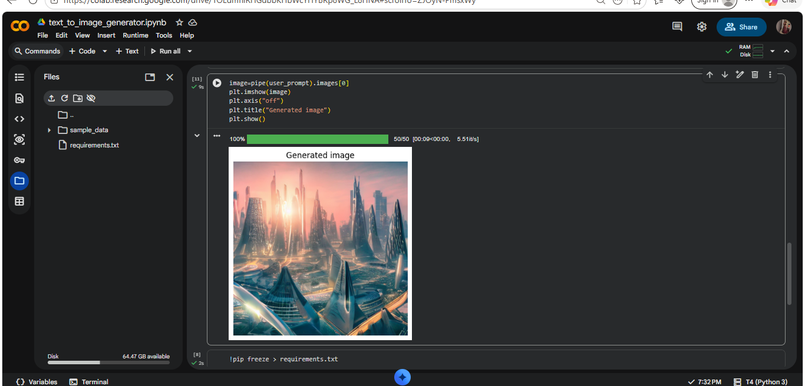

# 🖼️ Text-to-Image Generator

## 📌 Overview

This project generates images from text prompts using deep learning models. It leverages diffusion-based AI models to convert natural language descriptions into visual outputs.

---

## 🚀 Features

* Generate images from text prompts
* Uses state-of-the-art diffusion models
* Simple and easy-to-use interface
* Supports custom prompts

---

## 🛠️ Technologies Used

* Python
* Diffusers
* Transformers
* PyTorch

---

## 📂 Project Structure

```
text-to-image-generator/
│── app.py
│── requirements.txt
│── README.md
│── outputs/
```

---

## ▶️ How to Run

### 1. Install dependencies

```
pip install -r requirements.txt
```

### 2. Run the application

```
python app.py
```

### 3. Enter your prompt

Example:

```
A futuristic city at sunset
```

👉 Generated image will be saved in the project folder.

---## 📸 Sample Output




(Add your generated images here)

---

## 🎯 Future Improvements

* Web interface using Gradio/Streamlit
* Faster image generation
* High-resolution outputs

---

## 👩‍💻 Author

Kavya Khatri

---

## ⭐ Note

This project is created for learning purposes and demonstrates the use of AI models for creative image generation.
